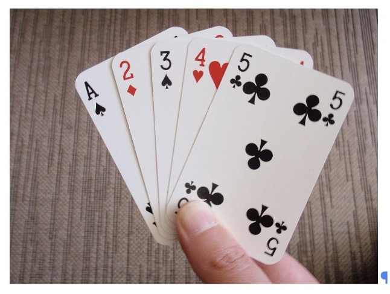
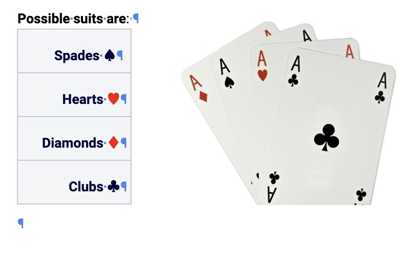
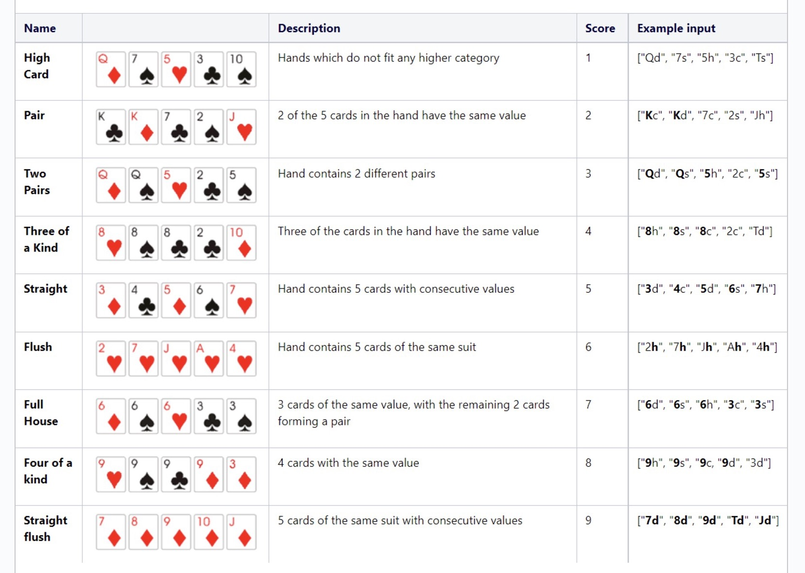

## Task requirements

### Poker hand 

* We want to find out the score of a poker hand. 
* A poker hand consists out of 5-cards. 
* Each card has a value and a suit

### Card Values and Suits

* Possible values are: 2, 3, 4,5, 6, 7, 8, 9, T (Ten), J (Jack), Q (Queen), K (King), A (Ace)
* Possible suits are: Spades, Hearts, Diamonds, Clubs

### Input

* we will receive 5 cards 
* each card is represented by an identifier
* the identifier consists out of value and suit 
  * e.g. 3s means value is 3, suit is Spades

### Output

From the example input of the rules table below, calculate our score.
Check screenshot.

